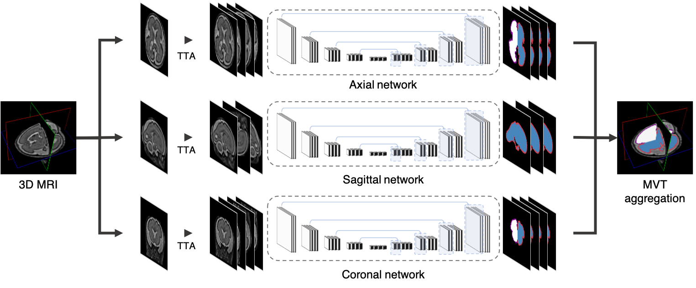

==================================
Fetal cortical plate segmentation
==================================

.. image:: https://img.shields.io/pypi/v/fetal_cp_seg.svg
        :target: https://pypi.python.org/pypi/fetal_cp_seg

.. image:: https://img.shields.io/travis/jwhong1125/fetal_cp_seg.svg
        :target: https://travis-ci.com/jwhong1125/fetal_cp_seg

.. image:: https://readthedocs.org/projects/fetal-cp-seg/badge/?version=latest
        :target: https://fetal-cp-seg.readthedocs.io/en/latest/?badge=latest
        :alt: Documentation Status

Fetal cortical plate segmentation with multiple predictions using fully convolutional networks

* Free software: GNU General Public License v3

Abstract
--------
With the development of fetal brain imaging technology, quantitative methods for evaluating fetal cortical development have been suggested. For reliable quantitative analysis of cortical volume and sulcal folding, accurate and automated segmentation of the cortical plate is first necessary. Accordingly, we propose a fully convolutional neural network for automatic segmentation of the cortical plate. We adopted a hybrid loss function to improve the segmentation accuracy, and multi-view (axial, coronal, sagittal) aggregation with test-time augmentation method to reduce errors caused by a single prediction and utilize 3D information. For evaluation of our method, 10-fold cross-validation of 52 fetuses brain MRI (22.9-31.4 weeks of gestation) was used. The proposed method obtained the Dice index 0.907 ± 0.027, 0.906 ± 0.031 and the mean surface distance error 0.182 ± 0.058mm, 0.185 ± 0.069mm for the left and right cortical plate respectively, and 0.980 ± 0.008, 0.979 ± 0.011 and 0.265 ± 0.090mm, 0.270 ± 0.110mm for inner volume of cortical plate. The results demonstrated that our method obtained higher accuracy in segmentation compared to other prior methods, and the proposed hybrid loss function and aggregation of multi-view with multiple predictions were effective in improving the accuracy. 

Arguments
----------

.. code:: bash

        python3 fetal_cp_seg.py                                         
                -h, --help            show this help message and exit
                -input INP, --input_MR INP [required]
                        input MR file name ('.nii or .nii.gz') or folder name
                -output OUT, --output_loc OUT [required]
                        Output path
                -axi AXI, --axi_weight AXI
                        Axial weight file
                -cor COR, --cor_weight COR
                        Coronal weight file
                -sag SAG, --sag_weight SAG
                        Sagittal weight file

Run
----

This ``plugin`` can be run in two modes: natively as a python package or as a containerized docker image.

Using PyPI
~~~~~~~~~~

To run using native env or virtual env, simply do a

.. code:: bash

    git clone https://github.com/jwhong1125/fetal_CP_segmentation.git
    pip3 install -r requirements_dev.txt   

and run with

.. code:: bash

    python3 fetal_cp_seg.py -input {.nii or .nii.gz or folder} -output {output_path}
                            [-axi {pretraied axial view network weights}
                             -cor {pretraied coronal view network weights}
                             -sag {pretraied sagittal view network weights}]

Using ``docker run``
~~~~~~~~~~~~~~~~~~~~

To run using ``docker``, be sure to assign an "input" directory to ``/incoming`` and an output directory to ``/outgoing``. *Make sure that the* ``$(pwd)/out`` *directory is world writable!*

.. code:: bash

    mkdir in out && chmod 777 out
    docker run --rm -v $(pwd)/in:/incoming -v $(pwd)/out:/outgoing      \
            jwhong1125/fetal_cp_seg fetal_cp_seg.py                     \
            -input /incoming                                            \
            -ouput /outgoing

Binary package
~~~~~~~~~~~~~~
For your convenience, we provide pre-compiled a ``binary file`` on ``ubuntu 16.04 or later``.
https://drive.google.com/file/d/1sYtdMqJoBjYpfqDjArxpnIYrvlqDNaYN/view?usp=sharing

Credits
-------

This package was created with Cookiecutter_ and the `audreyr/cookiecutter-pypackage`_ project template.

.. _Cookiecutter: https://github.com/audreyr/cookiecutter
.. _`audreyr/cookiecutter-pypackage`: https://github.com/audreyr/cookiecutter-pypackage
